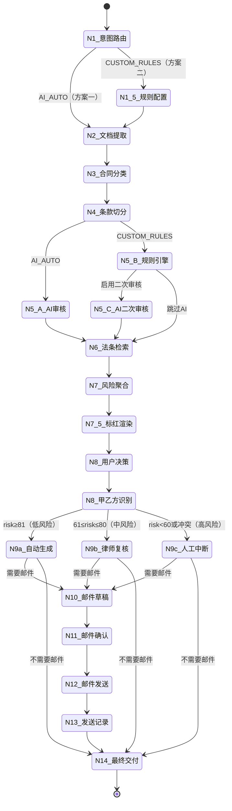

# 合同智能审核系统 - LangGraph 状态图

## Mermaid 状态图



## 节点说明

| 节点 | 名称 | 职责 |
|:---:|:---|:---|
| N1 | 意图路由 | 识别任务类型 + 审核模式（AI_AUTO / CUSTOM_RULES） |
| N1.5 | 规则配置 | 解析用户规则 + 确认是否启用AI二次审核 |
| N2 | 文档提取 | PDF/Word/OCR → 纯文本 + 坐标 |
| N3 | 合同分类 | 识别合同类型 |
| N4 | 条款切分 | 按条款切分 + 保留 bbox 坐标 |
| N5-A | AI审核 | 通用法律知识库全面审核 |
| N5-B | 规则引擎 | 逐条匹配用户自定义规则 |
| N5-C | AI二次审核 | 方案二可选，补充AI意见 |
| N6 | 法条检索 | 法条 + 类案检索，规则加权 |
| N7 | 风险聚合 | 合并去重 + 冲突检测 + 评分 |
| N7.5 | 标红渲染 | 按 bbox 在原文绘制红/黄/蓝高亮 |
| N8 | 用户决策 | 方案一：采纳/修改/不采纳；方案二：规则优先 |
| N8 | 甲乙方识别 | 确定用户立场 |
| N9a | 自动生成 | 低风险 → 自动出修订合同 |
| N9b | 律师复核 | 中风险 → LangGraph interrupt |
| N9c | 人工中断 | 高风险/冲突 → 强制签章 |
| N10~N13 | 邮件链路 | 草稿→确认→发送→记录 |
| N14 | 最终交付 | 汇总所有产物 + 律师转介 |

## 结构化输出 Schema

```json
{
  "risk_items": [
    {
      "clause_id": "Clause-5.2",
      "clause_title": "违约金条款",
      "text": "任何一方违约，应向对方支付合同总金额50%的违约金。",
      "text_location": {
        "page": 3,
        "bbox": [120, 450, 480, 470]
      },
      "risk_level": "High",
      "source": "DUAL",
      "ai_suggestion": "违约金50%过高，建议调整为不超过实际损失的30%",
      "rule_suggestion": "违反用户规则：违约金上限20%",
      "final_decision": "ACCEPT",
      "user_modified_text": null
    }
  ]
}
```

## source 字段取值说明

| 取值 | 含义 |
|:---|:---|
| `AI` | 仅AI审核产出（方案一） |
| `CUSTOM_RULE` | 仅规则引擎产出（方案二，未启用AI二次审核） |
| `DUAL` | AI + 规则一致，可信度最高 |
| `CONFLICT` | AI与规则冲突，强制人工介入 |
